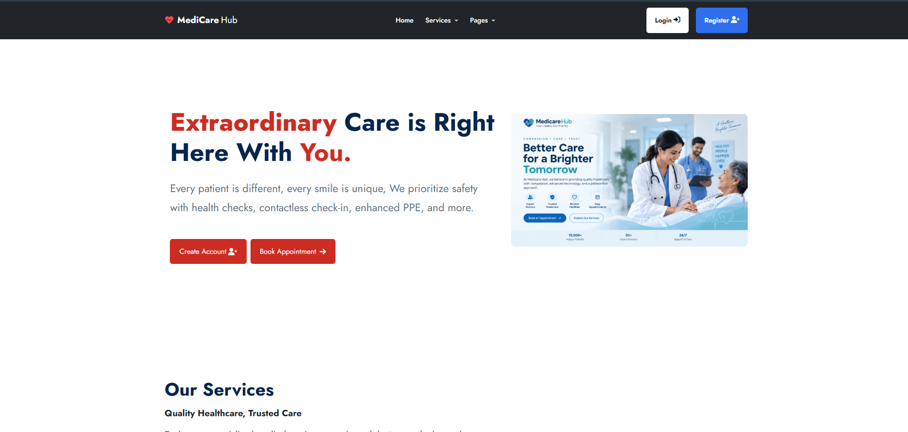
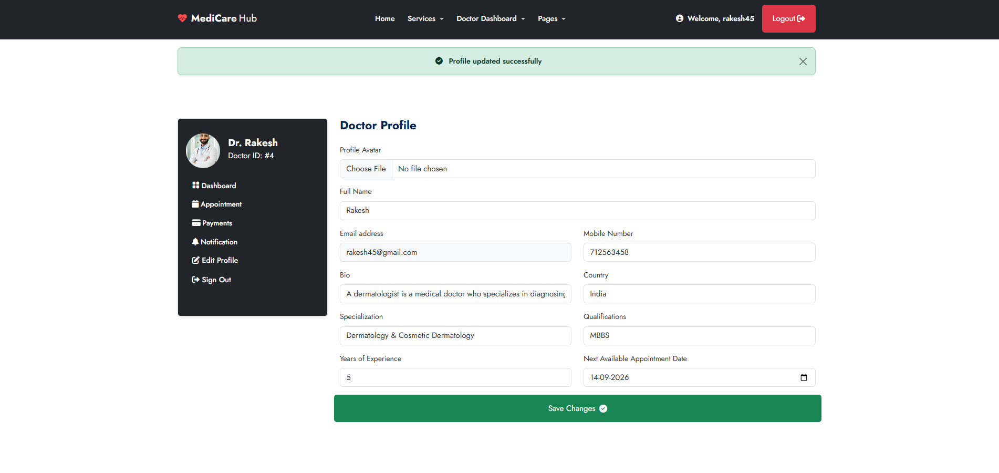
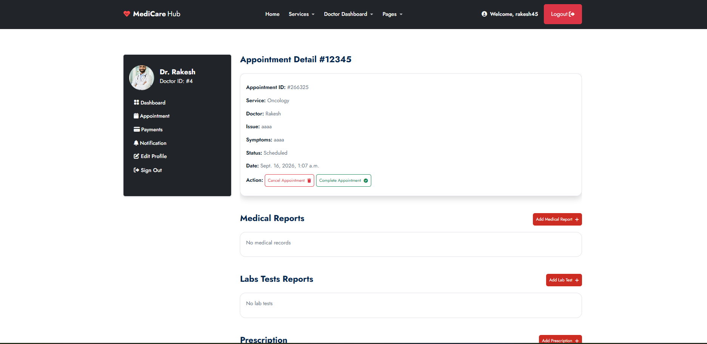
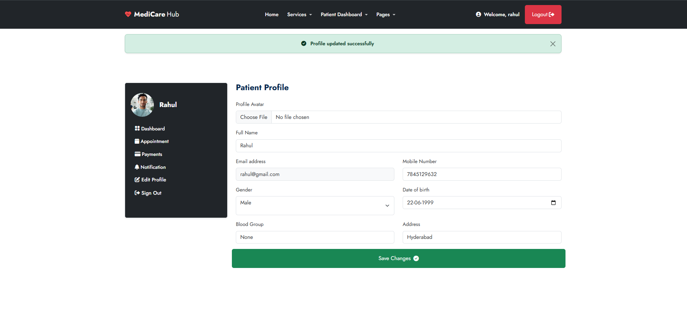
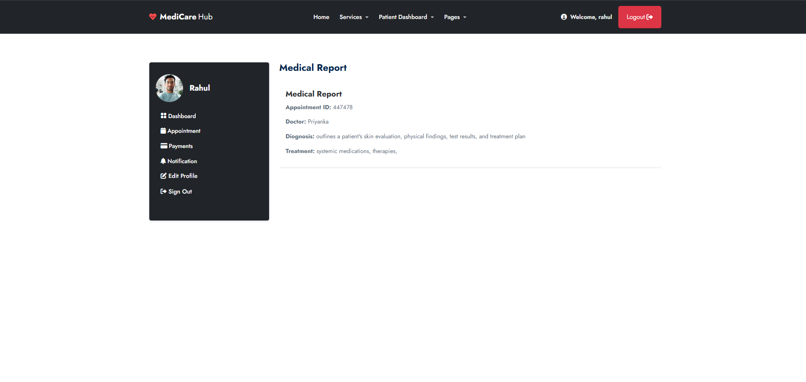
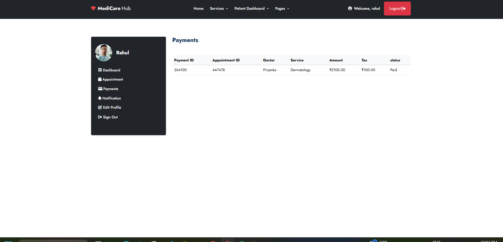
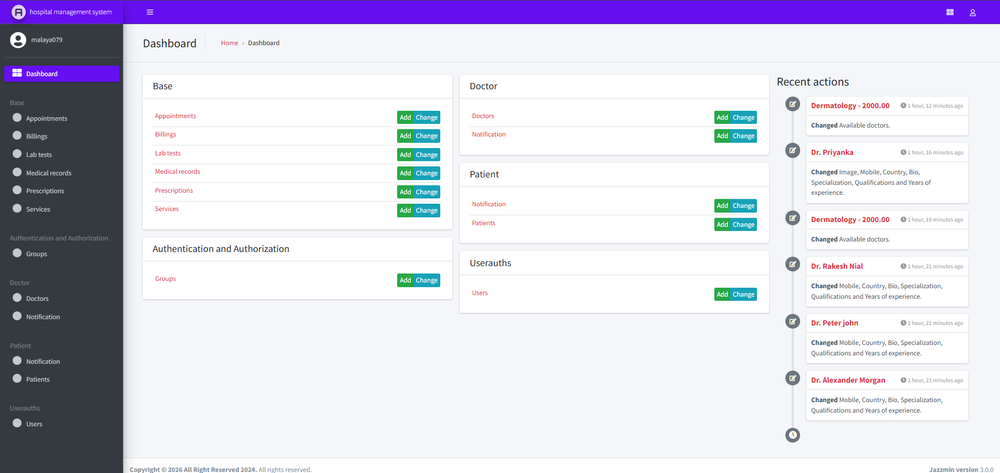

# 🏥 Hospital Management System

A full-stack **Hospital Management System** built with **Python and Django** to manage hospital operations digitally.The system provides separate functionality for administrators, doctors, and patients, including appointment management,
medical records, prescriptions, laboratory tests, billing, notifications, and online payments.

The project is designed as a practical, real-world healthcare management application with a responsive user interface and a Django-based backend.

---

## 📌 Project Overview

The Hospital Management System helps streamline common hospital activities through a centralized web application.

It allows:

* Patients to register and manage their profiles
* Patients to find doctors and book appointments
* Doctors to manage appointments and patient information
* Doctors to maintain medical records and prescriptions
* Staff/admins to manage doctors, patients, services, appointments, billing, and other hospital data
* Patients to view bills and make online payments
* Users to receive notifications for important activities

The application uses Django's authentication and database functionality together with a modern frontend to provide a complete hospital management workflow.

---

## ✨ Features

### 🔐 User Authentication

* User registration
* User login and logout
* Custom user model
* Email-based authentication
* Role-based access
* Protected pages using Django authentication
* Login and logout redirects
* Secure password handling through Django authentication

---

## 👨‍⚕️ Doctor Management

Doctors can have dedicated profiles containing:

* Doctor name
* Profile image
* Biography
* Specialization
* Qualification
* Services
* Professional information

Doctor functionality includes:

* Doctor dashboard
* View appointments
* Manage appointment status
* View patient information
* Manage medical records
* Create prescriptions
* Manage laboratory tests
* Manage billing information
* Receive notifications

---

## 🧑‍⚕️ Patient Management

Patients can:

* Create an account
* Manage their profile
* View available doctors
* View doctor profiles
* View medical services
* Book appointments
* View appointment history
* Cancel appointments where applicable
* View medical records
* View prescriptions
* View laboratory test information
* View billing information
* Make online payments
* Receive notifications

---

## 📅 Appointment Management

The appointment system allows patients and doctors to manage the complete appointment workflow.

### Patient Features

* Browse doctors
* View doctor specialization and details
* Select a doctor
* Schedule appointments
* View upcoming appointments
* View previous appointments
* Cancel appointments when applicable

### Doctor Features

* View scheduled appointments
* View patient information
* Update appointment status
* Manage completed/cancelled appointments

The system also generates notifications for important appointment activities.

---

## 🏥 Medical Services

The system provides a medical services section where hospital services can be managed.

Each service can contain:

* Service name
* Service description
* Service image
* Service price/cost
* Associated doctors

Examples of medical services include:

* Cardiology
* Neurology
* Pediatrics
* Dermatology
* Orthopedics
* General Medicine
* Diagnostic services

---

## 🩺 Medical Records

Doctors can maintain patient medical information through medical records.

Medical records can include information such as:

* Patient information
* Diagnosis
* Medical observations
* Treatment information
* Doctor information
* Record date

Patients can view their available medical records from their dashboard.

---

## 💊 Prescription Management

Doctors can create prescriptions for patients.

Prescription functionality includes:

* Patient information
* Doctor information
* Medicine details
* Instructions
* Prescription date

Patients can access their prescriptions through their account.

---

## 🧪 Laboratory Test Management

The system supports laboratory test management.

Doctors/staff can manage:

* Test information
* Patient details
* Test results
* Test status
* Related appointment/medical information

Patients can view their laboratory test information through their dashboard.

---

## 💰 Billing Management

The billing system allows hospital staff/doctors to manage patient billing information.

Billing functionality includes:

* Patient billing
* Appointment-related billing
* Service charges
* Payment status
* Billing records
* Online payment integration

Payment status can be updated after successful payment verification.

---

## 💳 Online Payment Integration

The project supports online payment functionality.

### Stripe

Stripe Checkout is integrated for secure online payments.

The payment workflow includes:

1. Patient opens the billing page
2. Patient selects the payment method
3. Django creates a Stripe Checkout Session
4. Patient is redirected to Stripe Checkout
5. Payment is processed
6. Stripe returns the customer to the application
7. Django verifies the payment session
8. Billing status is updated
9. Related appointment status can be updated
10. Notifications are generated

### PayPal

PayPal sandbox integration is included for testing payment functionality.

> Payment credentials and secret keys are stored through environment variables and should never be committed to GitHub.

---

## 🔔 Notification System

The system provides notifications for important activities.

Examples include:

* Appointment scheduled
* Appointment cancelled
* Payment completed
* Appointment completed
* Doctor-related notifications
* Patient-related notifications

Notifications help doctors and patients stay updated with their activities.

---

## 👨‍💼 Admin Dashboard

The project uses **Django Jazzmin** to provide an improved administration interface.

Administrators can manage:

* Users
* Doctors
* Patients
* Appointments
* Medical services
* Medical records
* Lab tests
* Prescriptions
* Billing
* Notifications
* Other database records

---

## 🗂️ Project Structure

```text
hospital-management-system/
│
├── my_site_hms/
│   ├── __init__.py
│   ├── settings.py
│   ├── urls.py
│   ├── asgi.py
│   └── wsgi.py
│
├── base/
│   ├── migrations/
│   ├── templates/
│   ├── admin.py
│   ├── models.py
│   ├── urls.py
│   └── views.py
│
├── doctor/
│   ├── migrations/
│   ├── templates/
│   ├── admin.py
│   ├── models.py
│   ├── urls.py
│   └── views.py
│
├── patient/
│   ├── migrations/
│   ├── templates/
│   ├── admin.py
│   ├── models.py
│   ├── urls.py
│   └── views.py
│
├── userauths/
│   ├── migrations/
│   ├── admin.py
│   ├── models.py
│   ├── urls.py
│   └── views.py
│
├── static/
├── media/
├── templates/
├── manage.py
├── requirements.txt
├── .gitignore
└── README.md
```

---

## 🛠️ Technology Stack

### Backend

* Python
* Django
* Django Authentication
* Django ORM

### Frontend

* HTML5
* CSS3
* Bootstrap
* Tailwind CSS
* JavaScript

### Database

* SQLite for development
* PostgreSql for Deploy


### Payment Gateways

* Stripe
* PayPal Sandbox

### Admin Interface

* Django Admin
* Django Jazzmin

### Development Tools

* Visual Studio Code
* Git
* GitHub
* Virtual Environment

---

## 📦 Important Python Packages

The project uses Django and several supporting packages.

Install all dependencies using:

```bash
pip install -r requirements.txt
```

Some of the major packages used include:

```text
Django
django-jazzmin
stripe
django-crispy-forms
crispy-bootstrap5
environs
Pillow
```

The exact versions are maintained in `requirements.txt`.

---

# 🚀 Installation & Setup

## 1. Clone the Repository

```bash
git clone https://github.com/Malayaranjan014/hospital-management-system.git
```

Move into the project directory:

```bash
cd hospital-management-system
```

---

## 2. Create a Virtual Environment

### Windows

```bash
python -m venv venv
```

Activate it:

```bash
venv\Scripts\activate
```

If using PowerShell:

```bash
.\venv\Scripts\Activate.ps1
```

---

## 3. Install Dependencies

```bash
pip install -r requirements.txt
```

---

## 4. Configure Environment Variables

Create a `.env` file in the project root.

Example:

```env
SECRET_KEY=your-secret-key
DEBUG=True

STRIPE_PUBLIC_KEY=your-stripe-public-key
STRIPE_SECRET_KEY=your-stripe-secret-key


PAYPAL_CLIENT_ID=your-paypal-client-id
PAYPAL_SECRET=your-paypal-secret
```

## 5. Apply Migrations

```bash
python manage.py makemigrations
python manage.py migrate
```

---

## 6. Create a Superuser

```bash
python manage.py createsuperuser
```

Follow the instructions in the terminal.

---

## 7. Run the Development Server

```bash
python manage.py runserver
```

Open the application in your browser:

```text
http://127.0.0.1:8000/
```

Admin panel:

```text
http://127.0.0.1:8000/admin/
```

---

# 🔄 Application Workflow

The basic application workflow is:

```text
User Registration
       ↓
User Login
       ↓
Patient / Doctor Dashboard
       ↓
Browse Doctors & Services
       ↓
Book Appointment
       ↓
Doctor Manages Appointment
       ↓
Medical Consultation
       ↓
Medical Record / Prescription / Lab Test
       ↓
Billing
       ↓
Online Payment
       ↓
Payment Verification
       ↓
Billing Status Updated
       ↓
Appointment Completed
       ↓
Notification
```

---

# 🔒 Security

The project follows Django's built-in security mechanisms, including:

* CSRF protection
* Password hashing
* Authentication middleware
* Login-required views
* Environment variables for sensitive credentials
* Secret key protection
* Secure database operations through Django ORM

For production deployment, additional security configuration should be enabled, including:

* `DEBUG=False`
* Production `SECRET_KEY`
* Configured `ALLOWED_HOSTS`
* HTTPS
* Secure cookies
* Production database
* Proper static/media configuration

---

# 🌐 Deployment

The application is intended to be deployed using **Render**.

---

# 📸 Screenshots

Screenshots of the application can be added here.


### 🏠 Home Page



### 👨‍⚕️ Doctor Profile



### 📅 Appointment Booking



### 🧑‍⚕️ Patient Dashboard



### 🩺 Medical Records



### 💳 Billing & Payment



### 🔐 Admin Dashboard




---

# 🎯 Future Improvements

Possible future enhancements include:

* Online video consultation
* Email notifications
* SMS notifications
* Advanced appointment scheduling
* Doctor availability calendar
* Prescription PDF generation
* Medical report uploads
* Advanced analytics dashboard
* Hospital staff management
* Multiple hospital/branch support
* PostgreSQL production database
* Cloud media storage
* Automated payment webhooks
* Improved role-based permissions
* REST API integration
* Mobile application

---

# 📚 Learning Outcomes

This project demonstrates practical experience with:

* Django project architecture
* Django models and relationships
* Custom user authentication
* CRUD operations
* Django ORM
* ForeignKey relationships
* OneToOne relationships
* ManyToMany relationships
* Forms and validation
* Authentication and authorization
* Payment gateway integration
* Database migrations
* Static and media file management
* Environment variable configuration
* Git and GitHub
* Production deployment preparation

---

# 👨‍💻 Developer

**Malaya Ranjan**

Full Stack Developer | Python | Django | SQL

---

## ⭐ Project

If you find this project useful or interesting, consider giving the repository a ⭐ on GitHub.

---

## 📄 License

This project is developed for educational and portfolio purposes.
